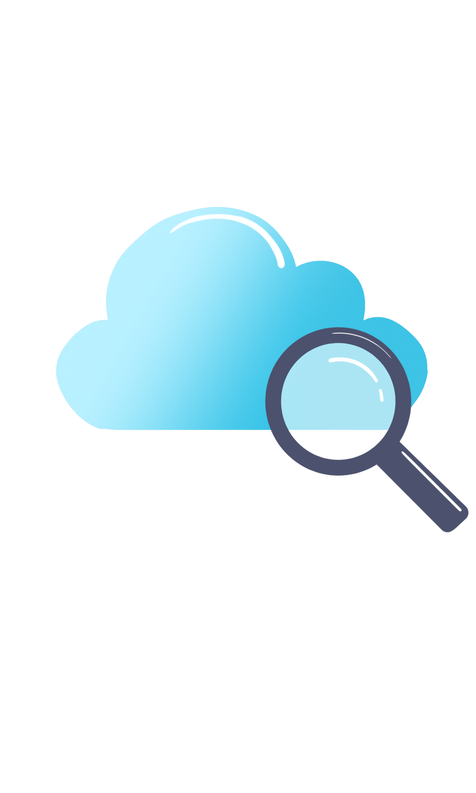
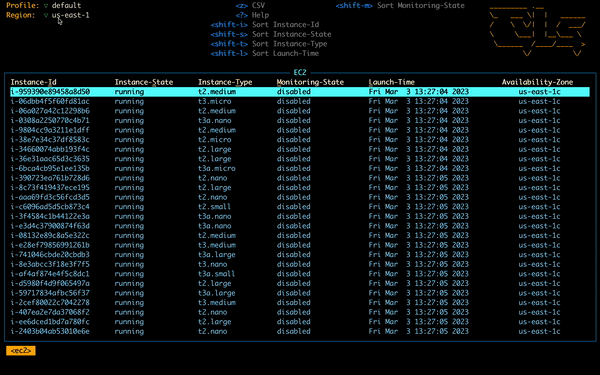
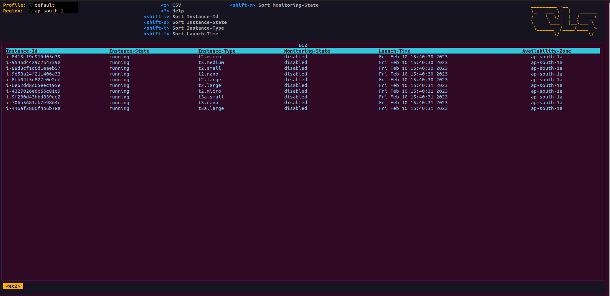
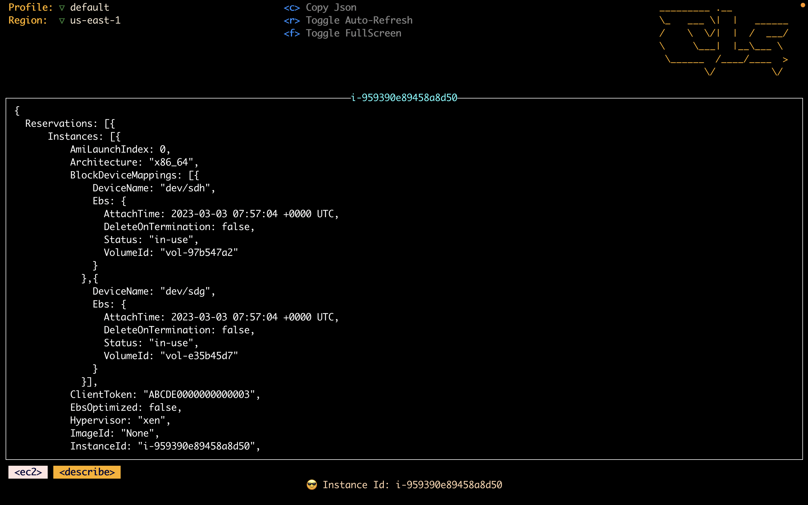
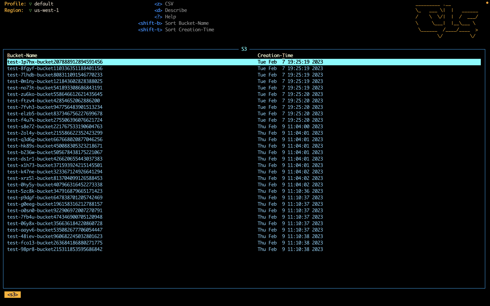
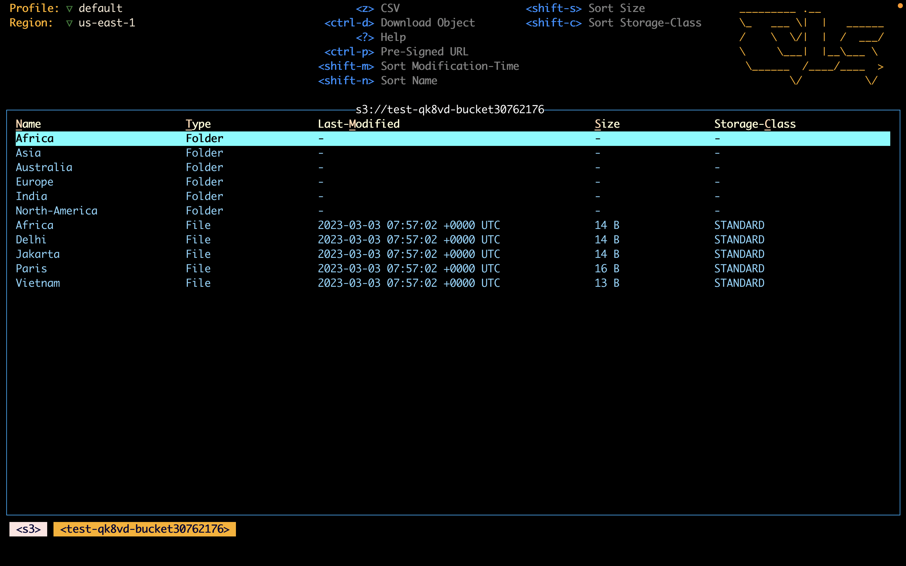
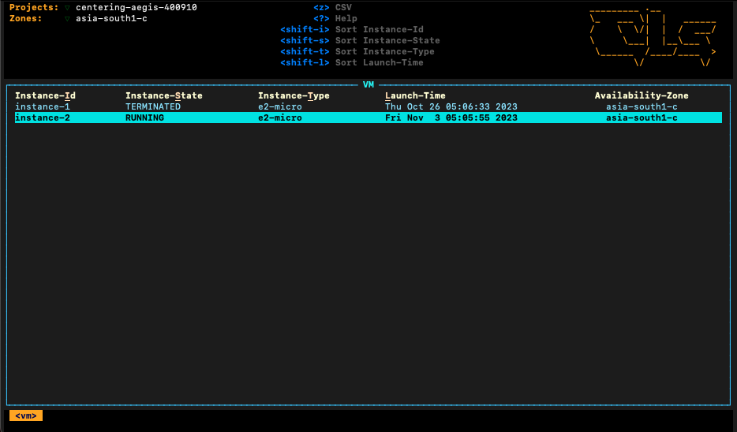
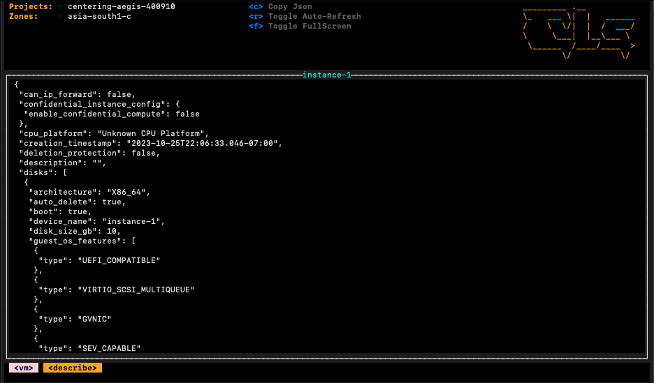
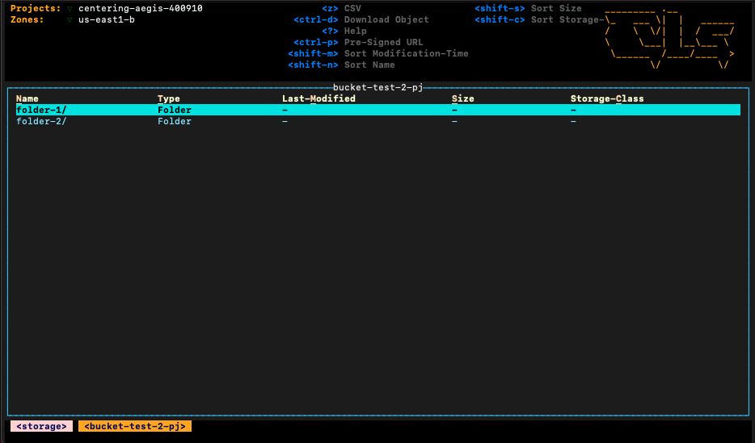
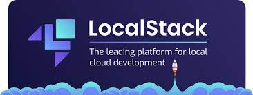

<p align="center">
      
</p>

## Cloudlens - k9s like CLI for AWS and GCP. 



AWS and GCP Console in your terminal! well, almost. Explore AWS and GCP services like EC2, S3, IAM, VPC, VM, Storage  etc. from your terminal. If you like k9s for Kubernetes, you'll love cloudlens.

## Installation

* Via [Homebrew](https://brew.sh/) for macOS or Linux

   ```shell
   brew install one2nc/cloudlens/cloudlens
   ```
* Using go install
      *cloudlens* requires go1.19 to install successfully. Run the following command to install the latest version -
   ```shell
       go install -v github.com/one2nc/cloudlens@latest
   ```

* Building from source code
      Cloudlens is currently in active development. We use Go 1.19. Follow these steps to build cloudlens locally:

       1. Clone the repo
       2. Build and run the executable

  To Run:
  ```shell
  make run
  ```

## Prerequisite
1. Docker installed on your local. Refer this [documentation](https://docs.docker.com/engine/install/)
2. If you want to use localstack for populating dummy data, use our repo [cloud-lens-populator](https://github.com/one2nc/cloud-lens-populator) 

## Usage

### Using UI
- For the simple usage, just run the `cloudlens` command without any options.
- This will open an UI to select cloud platform.
- Note: when selecting `GCP` as cloud, make sure to set `GOOGLE_APPLICATION_CREDENTIALS` env variable to gcp-credentials file's path.

```shell
cloudlens
```
### Using Sub-Commands
- Alternative to UI, you could also use sub-commands and flags to select cloud platform.
- To select AWS.
```shell
cloudlens aws
```
- To select GCP.
```shell
cloudlens gcp --cf="path/to/gcp-credentials.json"
```
For knowing all the options available, use:
```shell
cloudlens help
```

### Self Update
For updating to latest version, use:
```console
cloudlens update
```
### Using Localstack
- Configure localstack server. 
-  Use our repo [cloud-lens-populator](https://github.com/one2nc/cloud-lens-populator) to setup and populate dummy data.
- To run cloudlens with localstack use `aws` sub-command with `-l` or `--localstack` flag 
- By default cloudlens use port `4566`. Use   `--port` flag to pass different port
```console
cloudlens aws --localstack --port 4000
```

## Features

### AWS
For AWS Cloudlens supports viewing EC2 instances, S3 buckets, EBS volumes, VPCs, SQS queues, Lambda functions, Subnets, Security Groups, and IAM roles. 
### GCP
For GCP Cloudlens supports viewing VM instances, Storage buckets, Disks, Snapshots, Images.

 Read the [cloudlens documentation](https://one2n.gitbook.io/docs/) to know more.

## Screenshots
### AWS
1. EC2
      
1. EC2 Details
      

2. S3
      
2. S3 Details
      
### GCP
1. VM
      
1. VM Details
      

2. Storage
      
2. Storage Details
      

## Documentation

Please refer to our [cloudlens documentation](https://one2n.gitbook.io/docs/) to know more.


## Key Bindings

Cloudlens uses k9s like shortcuts for navigation. Listed below are few of the shortcuts:

| **Action**                                | **Command**   |
|-------------------------------------------|---------------|
| Show active keyboard mnemonics and help   | ?             |
| To bail out of cloudlens                  | :q ,   ctrl-c |
| Bails out of view/command/filter mode     | esc         |
| To view and switch to another AWS Service | :S3/EC2/VPC⏎  |
| To view and switch to another GCP Service | :storage/vm/disk⏎  |

## Note
**Cloudlens reads your ~/.aws/config file, but it does not store or send your access and secret key anywhere. The access and secret key is used only to securely connect to AWS API via AWS SDK.**

**Since cloudlens is in readonly mode, we recommend you create an access and secret key that only has readonly permissions to the AWS services.**

## Acknowledgements

We would like to express our sincere appreciation to `K9s` as it has been a invaluable source of reference for this project.

All materials licensed under [Apache v2.0](http://www.apache.org/licenses/LICENSE-2.0)

## We appreciate [localstack's](https://localstack.cloud/) assistance with the development


