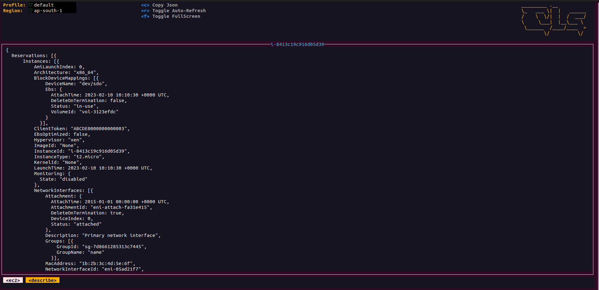

## Cloud-Lens - A Sophisticated Command Line Interface for Effortless AWS Service Management!

Your One-Stop Terminal Solution for Seamless AWS Service Management and Monitoring! With its intuitive UI and advanced features, it empowers you to effortlessly navigate, observe, and optimize your AWS environment, giving you more time to focus on your core business goals. Whether you're a seasoned cloud expert or just getting started, Cloud-Lens will elevate your AWS experience and take your service management to new heights.

## Building From Source

 Cloud-Lens is currently using go v0.0.1 . In order to build Cloud-Lens from source you must:

 1. Clone the repo
 2. Build and run the executable

      ```shell
      make run
      ```

## Key Bindings

Cloud-Lens uses aliases to navigate most AWS Services.

| Action                                                         | Command                       | Comment                                                                |
|----------------------------------------------------------------|-------------------------------|------------------------------------------------------------------------|
| Show active keyboard mnemonics and help                        | `?`                           |                                                                        |                                                                      |
| To bail out of Cloud-Lens                                             | `:q`, `ctrl-c`                |                                                                        |
| Bails out of view/command/filter mode                          | `<esc>`                       |                                                                        |
| To view and switch to another AWS Service               | `:`ctx⏎                       |                                                                        |


## Screenshots

1. EC2
      
1. EC2 Details
      

2. S3
      
2. S3 Details
      
